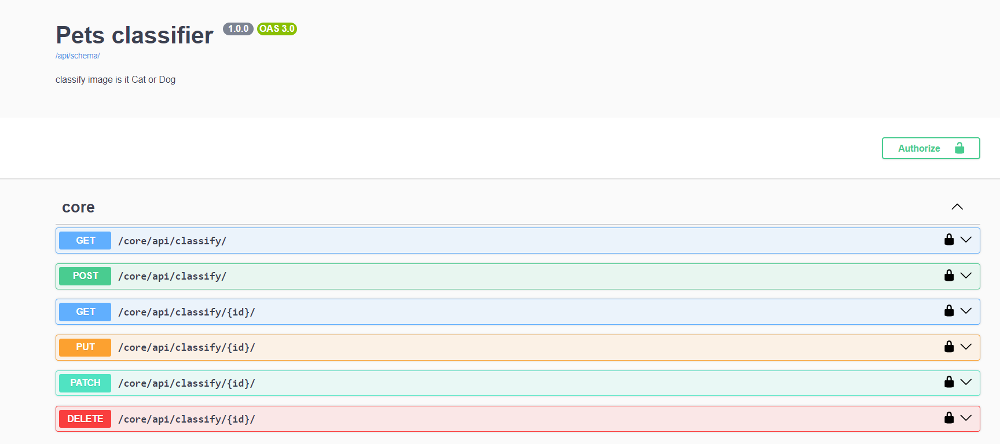
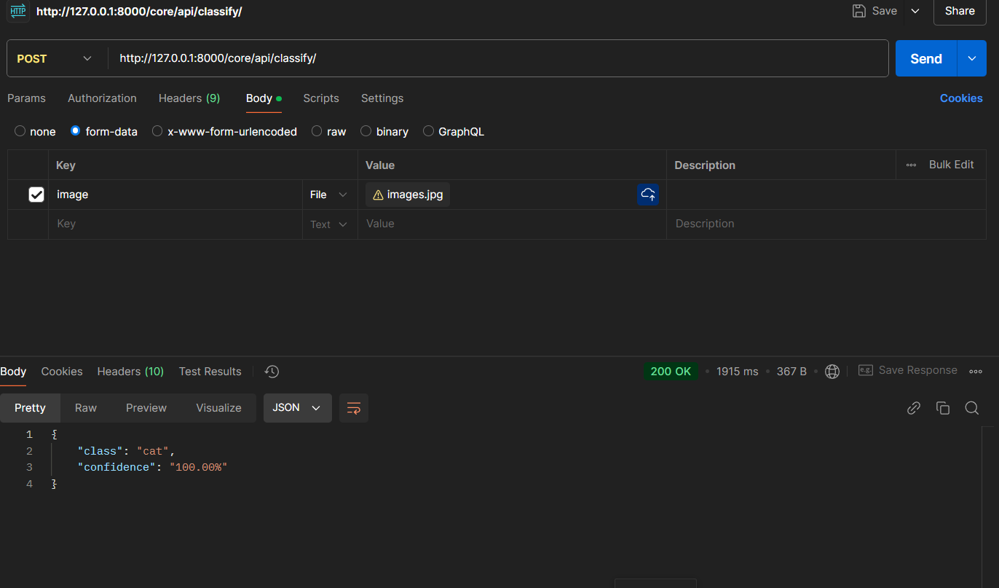

# Pet Classifier API



## Overview
A Django-based REST API that classifies images as either cats or dogs using machine learning. The API is built with Django REST framework and provides endpoints for image classification with confidence scores.

## Features
- Image classification between cats and dogs
- Confidence score for predictions
- RESTful API endpoints
- File upload support
- SQLite database for data persistence

## Project Structure
```
Django_API_project/
├── AI_Class/
│   ├── __pycache__/
│   ├── __init__.py
│   ├── asgi.py
│   ├── settings.py
│   ├── urls.py
│   └── wsgi.py
├── media/
│   └── uploads/
├── models/
│   └── cat_dog_classifier.h5
├── pets/
│   ├── migrations/
│   ├── __init__.py
│   ├── admin.py
│   ├── apps.py
│   ├── models.py
│   ├── serializers.py
│   ├── tests.py
│   ├── urls.py
│   ├── utils.py
│   └── views.py
├── Preparing_AI/
│   ├── data/
│   ├── img_to_test/
│   ├── model_creator.py
│   ├── model_test.py
│   └── summary.py
├── env/
├── manage.py
└── db.sqlite3
```

## API Endpoints

### Core Classification Endpoints
- `GET /core/api/classify/` - List all classifications
- `POST /core/api/classify/` - Submit an image for classification
- `GET /core/api/classify/{id}/` - Retrieve specific classification
- `PUT /core/api/classify/{id}/` - Update specific classification
- `PATCH /core/api/classify/{id}/` - Partially update classification
- `DELETE /core/api/classify/{id}/` - Delete classification

## Installation

1. Clone the repository
```bash
git clone 
cd Django_API_project
```

2. Create and activate virtual environment
```bash
python -m venv env
source env/bin/activate  # On Windows: env\Scripts\activate
```

3. Install dependencies
```bash
pip install -r requirements.txt
```

4. Run migrations
```bash
python manage.py migrate
```

5. Start the development server
```bash
python manage.py runserver
```

## Usage Example

### Classify an Image
```bash
curl -X POST http://127.0.0.1:8000/core/api/classify/ \
  -F "image=@path/to/your/image.jpg"
```

Response:
```json
{
    "class": "cat",
    "confidence": "100.00%"
}
```

## Development
- The AI model is trained using the scripts in the `Preparing_AI` directory
- Images are stored in the `media/uploads` directory
- Model file is stored in the `models` directory

## Testing
```bash
python manage.py test
```

## Contributing
1. Fork the repository
2. Create your feature branch (`git checkout -b feature/AmazingFeature`)
3. Commit your changes (`git commit -m 'Add some AmazingFeature'`)
4. Push to the branch (`git push origin feature/AmazingFeature`)
5. Open a Pull Request

## License
This project is licensed under the MIT License - see the LICENSE file for details